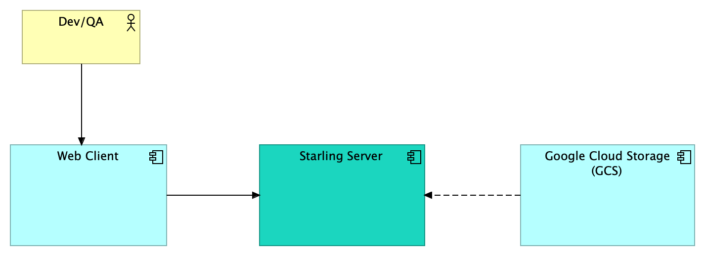
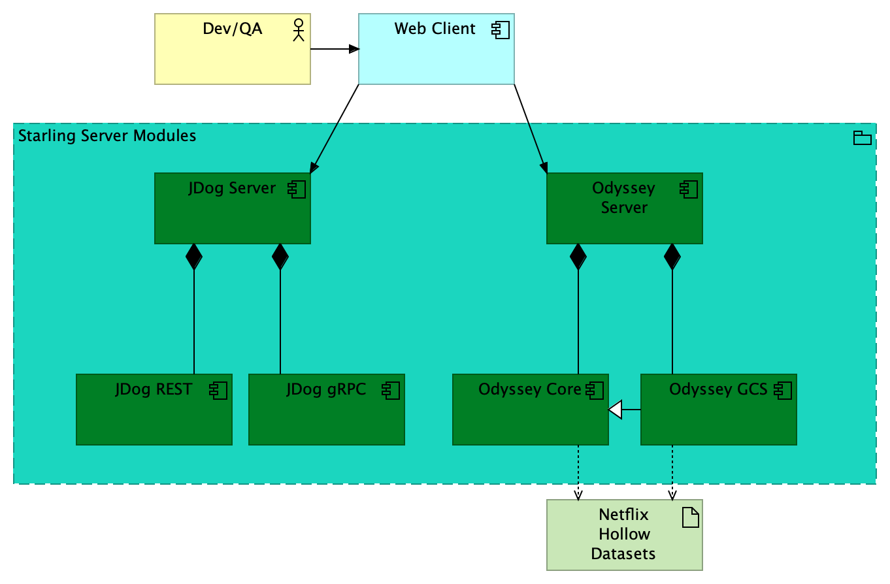
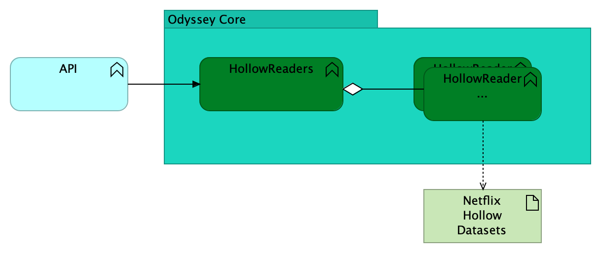

# starling-server

Starling-server is a collection of web servers and related components to be used as test back-ends for load generation or mocking.

C4 System Diagram 
C4 Container Diagram 
C4 Component Diagram 

## jdog

jdog is a Java Dynamic Object Generator web server. The response it generates is based on the request received. REST/http and gRPC endpointys are provided.

## odyssey

odyssey is a set of modules designed to serve the contents of Netflix Hollow data sets, with or without transformation through a templating engine.

See [odyssey-core README](odyssey-core/README.md) for more information.

## jdog-grpc-interface

interface definition for a grpc interface to the JDog service
